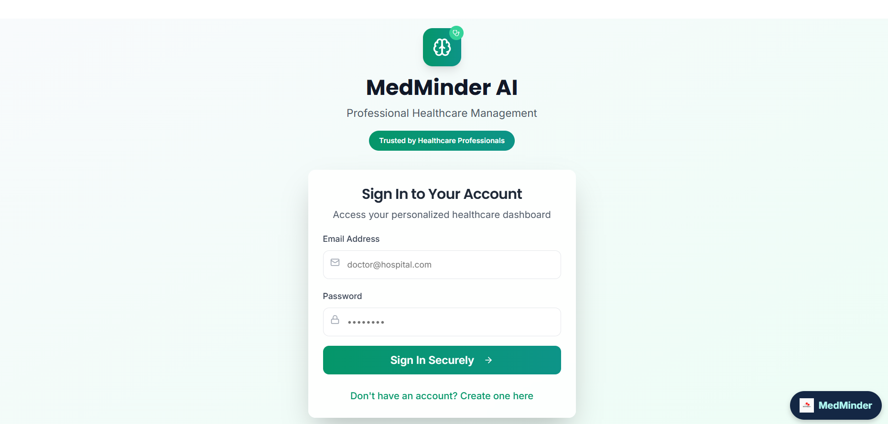
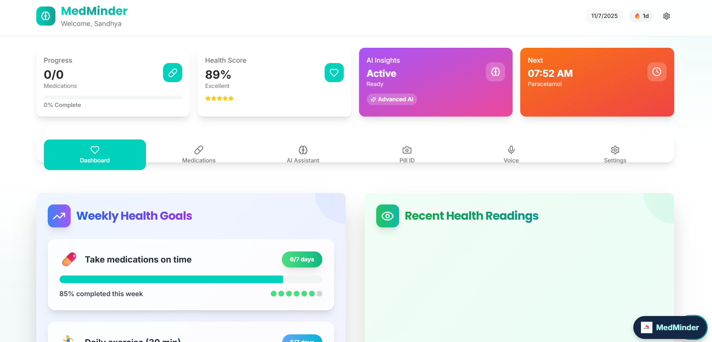

# MedMinder AI 💊🧠

MedMinder AI is a professional health companion dashboard designed to help users track their medication, monitor health stats, receive AI-powered insights, and stay on top of their daily health goals.




---

## ✨ Features

- ✅ **Today's Progress** – See medications due and completion rate.
- 💯 **Health Score** – Visualize your overall health rating with AI feedback.
- 🧠 **AI Insights** – Unlock advanced suggestions tailored to your health.
- ⏰ **Reminders** – Get notified of your next steps (or celebrate when you're done!).
- 📈 **Weekly Goals** – Track long-term progress and stay motivated.
- 🔍 **Pill Identifier**, 🗣️ **Voice Mode**, 🆘 **Emergency Access** and more.

---

## 🚀 Tech Stack

- [React](https://reactjs.org/)
- [Vite](https://vitejs.dev/)
- [TypeScript](https://www.typescriptlang.org/)
- [Tailwind CSS](https://tailwindcss.com/)
- [shadcn/ui](https://ui.shadcn.com/)

---

## 🧪 Getting Started

### 1. Clone the repository

```bash
git clone <YOUR_GIT_URL>
cd <YOUR_PROJECT_NAME>
```

### 2. Install dependencies

```bash
npm install
```

### 3. Run the dev server

```bash
npm run dev
```

Your app will be running at `http://localhost:5173` by default.

---

## 🌐 Deployment

You can deploy this project using:

- [Vercel](https://vercel.com/)
- [Netlify](https://www.netlify.com/)
- [Render](https://render.com/)

---

## 🛠️ Folder Structure (optional)

```bash
/src
  /components    # Reusable UI components
  /pages         # Main screens like Dashboard, Medications, etc.
  /assets        # Images and static files
  /lib           # Helper functions or services
  /styles        # Global and Tailwind styles
```

---

## 📄 License

MIT © [Sandhya]

---

> Made with ❤️.

